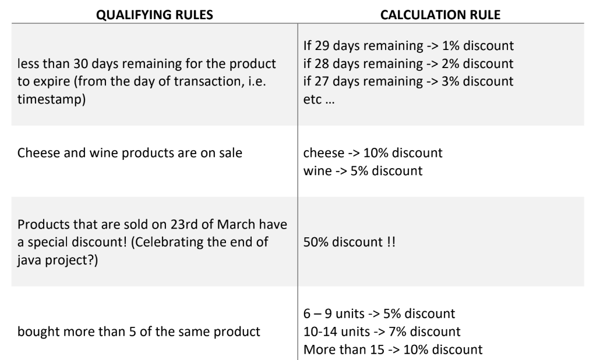
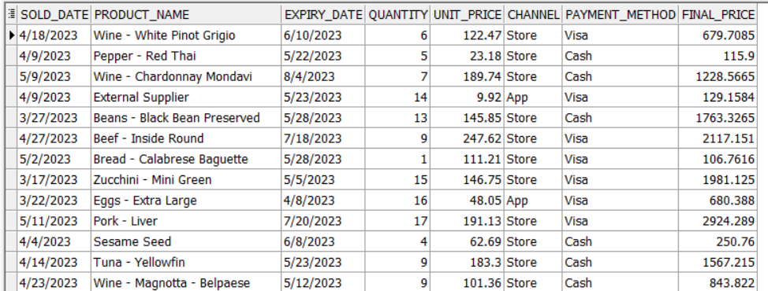
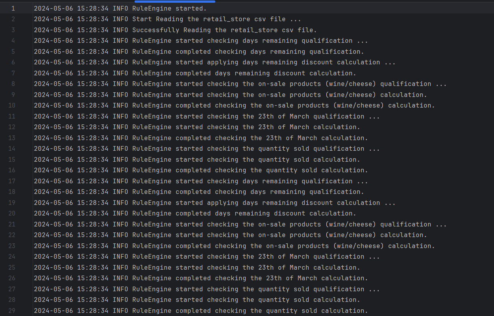

# Rule-Engine-using-Scala
## The Problem Statement
A huge retail store wants a rule engine that qualifies orders’ transactions to discounts based
on a set of qualifying rules. And automatically calculates the proper discount based on some
calculation rules as follows:

I read this data using pandas to do simple exploratory data analysis (EDA) on it, to see the data distributions and unique values for each column and so on.
And I retrieve the wine and cheese products string pattern to recognize them using regex in my code logic in Scala.

## The functions that I created:
### Day Remaining Qualifying Rule
* `days_remaining_qualifier` – it returns the number of remaining days of a product to be expired
* `days_remaining_discount_calculator` – it returns the discount as double value
* `days_remaining_discount_percentage` – it returns the discount as percentage

### On-Sale Products Qualifying Rule
`onSaleProducts_qualifier` – it checks if the product is a wine or cheese or otherwise and map the required discount amount on each one
  
### Special Discount for Products Sold in 23th Of March
`marchSpecialDiscount` – it checks if the sold date is in 23th of March, and if it is apply on it the proper discount value

### Quantity of Products Sold
`quantitySoldDiscount` – if chekcs the number of quantities sold of each product and calculate the discount according to the quantity range it falls into as mentioned in the problem statement.

### Sales made through the App with specified quantity range Qualifying Rule
* `quantityQualifier` - it cheks if the quantity sold in the range of multiple of 5, and for each range it returns specfic discount value
* `salesApp` it firstly check if the channel in `App`, and if it is, call `quantityQualifier` and the return from it will be the return value of salesApp function

### Payment method Qualifying Rule
`visaPaymentMethod` - it takes the payment method as input and checks if it `Visa` it will return 0.05, otherwise return 0.0

## Database Connection
I calculated the final discount by taking the average of the two maximum discount values of each product, then I created a table RetailSore that holds the following columns:
*	SOLD_DATE
*	PRODUCT_NAME
*	EXPIRY_DATE
*	QUANTITY
*	UNIT_PRICE
*	CHANNEL
*	PAYMENT_METHOD
*	FINAL_PRICE
The connection that I used is Oracle connection using JDBC oracle drive, then I insert into this table the values of source file csv file with the FINAL_PRICE column that was calculated through the project code.

## Logging the Engine Rule Interactions
Finally, I created a function that write into ‘rules_engine.log’ file. It writes the INFO operations happened in the Engine Rule.

